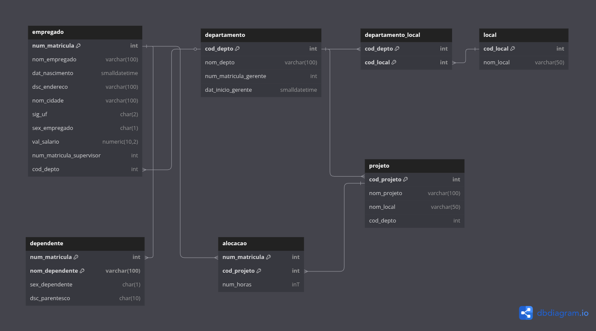
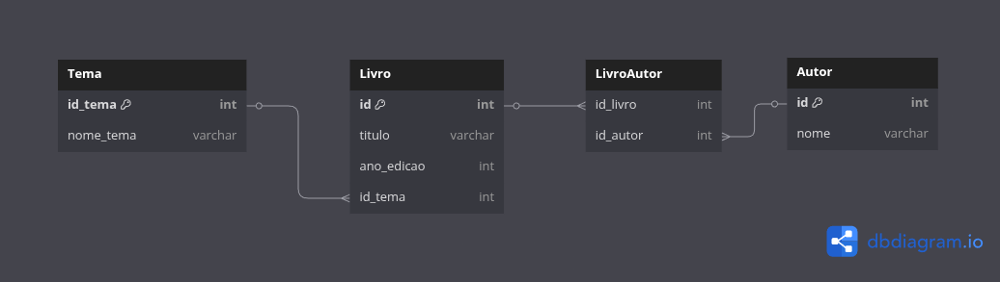
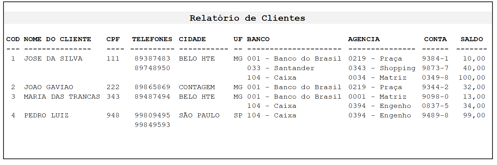
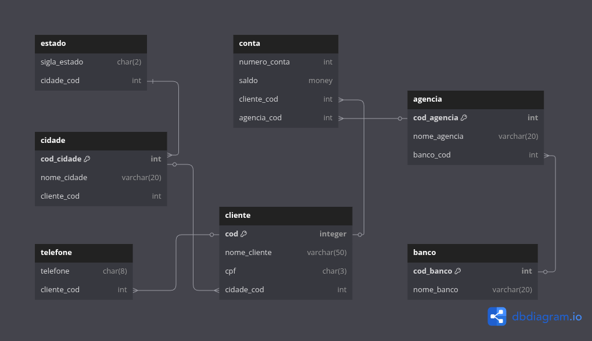

# Module 1: Relational Databases and SQL Language

In this self-paced module, I explored the fundamentals of relational database systems, including the distinctions between OLTP and OLAP, and I learned to model data using ER diagrams and conceptual, logical, and physical schemas that enforced cardinality and normalization rules. I then mastered the SQL `SELECT` statement, applied filters, ranges, `DISTINCT`, sorting, and table joins to extract precisely the data I needed. In the final chapter, I tackled date/time handling, aggregate functions (`SUM`, `AVG`, `MIN`, `MAX`), `HAVING` filters, and more advanced constructs such as subqueries, views, and combining result sets. Throughout the module, I consulted curated readings for deeper insights, completed hands-on exercises to reinforce each topic, and participated in instructor-moderated discussion forums. By the end, I was confident in designing relational models, writing sophisticated SQL queries, and extracting meaningful insights from complex datasets.


## ER Diagram Challenges

### Company Database ER Model

This ER diagram models the `bd_empresa` database and includes an enhanced structure where the `departamento_local` table no longer stores city acronyms directly. Instead, a new `local` table was added to contain the location code, acronym, and city name, improving data normalization.



---

### Library System ER Model

This ER diagram was created to represent a library system based on the following requirements:

1. Books are categorized by themes, and each theme can have multiple titles.  
2. Every book has a title and an edition year.  
3. Each book may be written by one or more authors, and an author may have written multiple books.



---

### Banking System ER Model

In this challenge, I was given a customer report from a banking system and tasked with designing a data model capable of supporting and reproducing it. I analyzed the structure and contents of the report and identified key entities such as clients, accounts, agencies, cities, and banks. Based on this, I created a fully normalized Entity-Relationship Diagram (ERD), ensuring compliance with the First, Second, and Third Normal Forms (1NF, 2NF, and 3NF). The resulting model eliminates redundancy, maintains data integrity, and supports efficient queries across relational joins.

**Original Customer Report:**



**Normalized ER Diagram:**




## Prerequisites

- Docker ≥ 20.10
- Docker Compose ≥ 1.27
- Database client (e.g. DBeaver, SSMS, etc)

## Getting Started

1. **Clone the repository**
   ```bash
   git clone https://github.com/BrunoChiconato/pos-graduacao-engenharia-de-dados.git
   cd pos-graduacao-engenharia-de-dados/relational-db
   ```

2. **Prepare directories**
   ```bash
   mkdir -p sql/data
   ```

3. **Configure the SA password** (optional)
   - Default is `Admin123!`. To change, edit `docker-compose.yml` under:
     ```yaml
     environment:
       MSSQL_SA_PASSWORD: "YourNewStrong!Pass1"
     ```

4. **Start services**
   ```bash
   docker compose up -d
   ```

5. **Verify SQL Server is ready**
   ```bash
   docker compose logs sqlserver -f
   ```
   Wait for the line:
   ```text
   SQL Server is now ready for client connections.
   ```

6. **Connect to SQL Server**
   - Using **SSMS/Azure Data Studio**:
     - Server: `localhost,1433`
     - User: `sa`
     - Password: your SA password
   - Using **DBeaver**:
     - Host: `localhost`
     - Port: `1433`
     - Database: `master`
     - Username: `sa`
     - Password: your SA password
   - Using **sqlcmd** inside the container:
     ```bash
     docker compose exec sql_init bash -c "echo 'SELECT @@VERSION;' | sqlcmd -S sqlserver -U sa -P 'Admin123!'"
     ```

## Data Persistence

- All database files (MDF, LDF) persist under `sql/data` on the host.
- To stop without deleting data:
  ```bash
  docker compose down
  ```
- To remove containers and volumes:
  ```bash
  docker compose down -v
  ```
